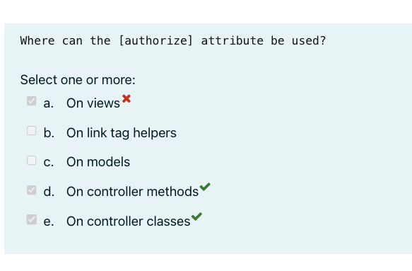
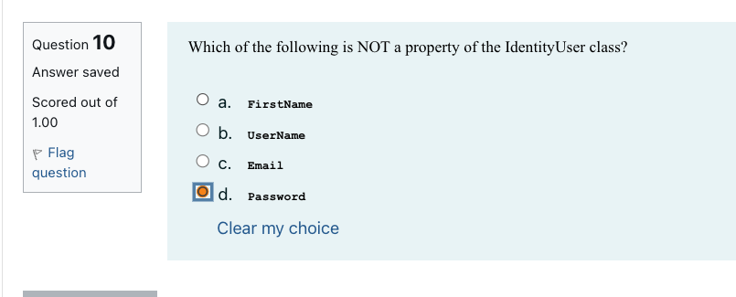
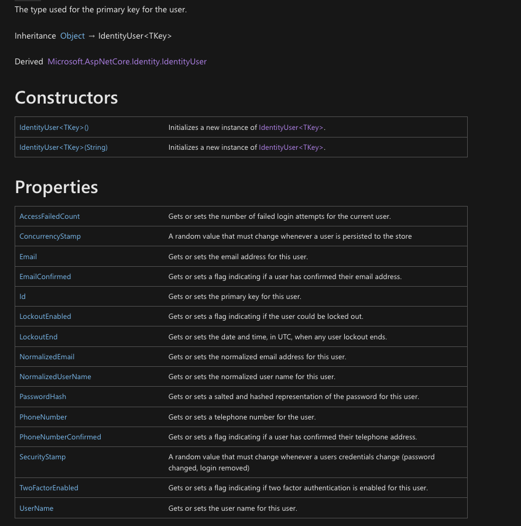

# Quiz 3

## [Authorize] attribute

For this question, I believe I understand why it is incorrect, but I want to confirm my reasoning.

Here the view is the .cshtml, and the controller method is where the Authorize attribute is located, not in the .cshtml, therefore the authorize attrubite does not need to be in the view (and will not work in there), but it is already restriced before control is inverted.

## IdentityUser Properties

IdentityUser

